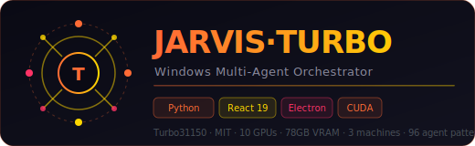

<div align="center">
  
  <br/><br/>

  [](LICENSE)
  [](https://python.org)
  [](https://react.dev)
  [](#)
  [](#)
  [](#hardware)
  [](#agents)
  [](#mcp)

  <br/>
  <p><strong>Windows Multi-Agent Orchestrator · 3 machines · 10 GPUs · 78GB VRAM · React 19 / Vite 6 / Electron Dashboard</strong></p>
  <p><em>Orchestration IA multi-agents sous Windows — trading quantitatif, cluster GPU, voice CUDA, dashboard temps réel</em></p>

  [**Architecture →**](#-architecture) · [**Hardware →**](#-hardware) · [**Dashboard →**](#-dashboard) · [**Agents →**](#-agents) · [**DERNI ULTIMATE →**](#-derni-ultimate)
</div>

---

## Présentation

**JARVIS·TURBO** est l'orchestrateur multi-agents Windows de Franc Delmas. Il coordonne **3 machines physiques**, **10 GPUs** (78GB VRAM cumulé), un dashboard React 19/Electron en temps réel, et une suite d'agents autonomes pour le trading, le code, et l'automatisation.

C'est le pendant Windows de JARVIS·OS Linux — les deux systèmes se synchronisent via WebSocket pour former une infrastructure IA distribuée complète.

---

## Architecture

```
JARVIS·TURBO — Architecture 3 machines
────────────────────────────────────────────────────────────────────────
  M1 — MASTER / ORCHESTRATEUR           M2 — LMT2                M3 — SERVER
  ┌─────────────────────────────┐    ┌──────────────┐    ┌───────────────────┐
  │ Ryzen 7 5700X3D · 46GB      │    │ LM Studio    │    │ 45GB RAM          │
  │ 6 GPUs : 4×1660S + 2060-12GB│    │ qwen3-30b    │    │ 3× Quadro GPU     │
  │         + 3080-10GB         │    │ deepseek-r1  │    │ Inference lourde  │
  │                             │    │              │    │                   │
  │  ┌───────────────────────┐  │    └──────┬───────┘    └───────┬───────────┘
  │  │  JARVIS·TURBO Core    │  │           │                    │
  │  │  WS :9742             │◄─────────────┴────────────────────┘
  │  │  MCP 602 handlers     │  │
  │  └───────────┬───────────┘  │
  │              │              │
  │  ┌───────────▼────────────┐ │
  │  │   Agent Layer          │ │
  │  │  OpenClaw · 96 patterns│ │
  │  │  Whisperflow CUDA voice│ │
  │  │  Comet browser control │ │
  │  │  Claude SDK            │ │
  │  │  DERNI ULTIMATE n8n    │ │
  │  └───────────┬────────────┘ │
  │              │              │
  │  ┌───────────▼────────────┐ │
  │  │  Dashboard Electron    │ │
  │  │  React 19 · Vite 6     │ │
  │  │  WS :9742 telemetry    │ │
  │  └────────────────────────┘ │
  └─────────────────────────────┘
```

---

## Hardware

| Machine | Rôle | CPU | RAM | GPUs | VRAM |
|---------|------|-----|-----|------|------|
| **M1 — Master** | Orchestration · Dashboard · WS | Ryzen 7 5700X3D | 46 GB | 4×GTX1660S + RTX2060-12GB + RTX3080-10GB | 34 GB |
| **M2 — LMT2** | LM Studio · Inférence LLM | — | — | — | 24 GB+ |
| **M3 — Server** | Compute · Inference lourde | — | 45 GB | 3× Quadro | 20 GB+ |
| **Total** | — | — | 91 GB+ | **10 GPUs** | **~78 GB** |

---

## Structure du projet

```
turbo/
├── main.py                     ← Orchestrateur central Python
├── core/                       ← Noyau JARVIS·TURBO
│   ├── agent_manager.py        ← Gestion multi-agents
│   ├── cluster_manager.py      ← Coordination M1/M2/M3
│   ├── ws_server.py            ← WebSocket :9742
│   └── mcp_bridge.py          ← Bridge MCP handlers
├── dashboard/                  ← Interface React 19
│   ├── src/
│   │   ├── components/         ← Widgets GPU, agents, trading
│   │   ├── pages/              ← Monitoring, trading, voice
│   │   └── stores/             ← State management
│   └── electron/               ← App desktop wrapper
├── openclaw-skills/            ← 96 patterns d'agents autonomes
├── whisperflow/                ← Voice pipeline CUDA
├── cowork/                     ← Co-développement IA sessions
├── n8n_workflows/              ← Workflows trading automatisés
├── scripts/                    ← Scripts déploiement / maintenance
├── docker/                     ← Dockerfiles multi-arch
├── systemd/                    ← Services Linux (M3)
├── ansible/                    ← Déploiement automatisé
├── knowledge/                  ← Base de connaissances JARVIS
├── docs/                       ← Documentation technique
└── src/                        ← Modules Python principaux
```

---

## Dashboard

Le dashboard **React 19 / Vite 6 / Electron** offre une interface cyberpunk temps réel :

```
Dashboard JARVIS·TURBO — Composants
┌─────────────────────────────────────────────────────────┐
│  GPU Heatmap     │  Cluster Monitor  │  Agent Control   │
│  (10 GPUs)       │  M1/M2/M3 health  │  96 patterns     │
├─────────────────────────────────────────────────────────┤
│  Voice Console   │  Trading Live     │  Log Stream      │
│  Whisperflow     │  DERNI ULTIMATE   │  WS :9742        │
├─────────────────────────────────────────────────────────┤
│  MCP Inspector   │  n8n Workflows    │  Memory Graph    │
│  602 handlers    │  20 actifs        │  per-machine     │
└─────────────────────────────────────────────────────────┘
```

- Thème dark cyberpunk · JetBrains Mono · couleurs GPU temps réel
- WebSocket :9742 → telemetrie GPU / RAM / VRAM toutes les 500ms
- Agent control panel → démarrer/arrêter/configurer les 96 patterns
- Voice command console → retranscription Whisper en temps réel

---

## Agents

### OpenClaw — 96 Patterns autonomes

**OpenClaw** est le moteur d'agents autonomes. Il exécute 96 patterns d'actions :

| Catégorie | Patterns | Exemples |
|-----------|----------|---------|
| **Trading** | 28 | scan breakout, consensus multi-IA, TP/SL auto |
| **Code** | 20 | refactor auto, tests, commit, PR generation |
| **Social** | 18 | LinkedIn post, GitHub automation, Twitter |
| **Système** | 15 | backup, deploy, health check, restart |
| **Voice** | 8 | commandes vocales → actions système |
| **Browser** | 7 | Comet page control, scraping |

### Whisperflow — Voice CUDA

Pipeline voix-vers-action sur CUDA :
```
Microphone → Whisper large-v3 CUDA → Intent → Action
             < 300ms latence        96 patterns
```

### Comet — Browser Control

Contrôle de navigateur sans credentials :
- Gmail / Google Calendar → sans OAuth
- LinkedIn → publication automatique
- GitHub → issues / comments via browser sessions

---

## DERNI ULTIMATE

**DERNI ULTIMATE** est le système de trading algorithmique intégré à JARVIS·TURBO :

```
GitHub: Turbo31150/DERNI-ULTIMATE-v1000
Stack: n8n 32 nœuds · MEXC Futures · LM Studio qwen3-30b · Gemini · Telegram

Workflows (5):
  SCAN    (30s)  — Détection breakouts sur 2800+ paires MEXC
  CALL    (5min) — Consensus multi-IA (vote STRONG/NORMAL/SKIP)
  MARGIN  (15s)  — Alertes liquidation ANCRAGE
  TP/SL   (10s)  — Automation entrées/sorties
  HOURLY  (1h)   — Résumé Telegram

Signal types: BREAKOUT · REVERSAL · BOUNCE · MOMENTUM · FVG
TP/SL: TP1 +1.5% (33%) · TP2 +3% (75%) · TP3 +7% (100%) · SL -1.2%
```

---

## MCP — 602 Handlers

```python
# .mcp.json — extrait des serveurs MCP connectés
{
  "trading":     {"handlers": 95,  "port": 8766},
  "cluster":     {"handlers": 88,  "port": 8767},
  "openclaw":    {"handlers": 80,  "port": 8768},
  "voice":       {"handlers": 72,  "port": 8769},
  "comet":       {"handlers": 65,  "port": 8770},
  "filesystem":  {"handlers": 60,  "port": 8771},
  "dashboard":   {"handlers": 48,  "port": 8772},
  "n8n":         {"handlers": 42,  "port": 8773},
  "misc":        {"handlers": 52,  "port": 8774}
}
```

---

## Installation

```bash
git clone https://github.com/Turbo31150/turbo.git
cd turbo

# Python — backend
pip install uv && uv sync
# ou: pip install -r requirements.txt

# Dashboard — React / Electron
cd dashboard && npm install
npm run build

# Configuration
cp .env.example .env
# Renseigner: ANTHROPIC_API_KEY, LM_STUDIO_URL, MEXC keys, Telegram...

# Lancer
python main.py            # Backend
cd dashboard && npm start # Dashboard Electron
```

### Docker

```bash
docker-compose up -d
# jarvis-core :8765 · dashboard :3000 · n8n :5678
```

---

## Variables d'environnement

```env
# Cluster
M1_WS=ws://127.0.0.1:9742
M2_LM_STUDIO=http://192.168.1.XX:1234
M3_ENDPOINT=http://192.168.1.XX:8080

# IA
ANTHROPIC_API_KEY=sk-ant-...
OPENAI_API_KEY=...               # ChatGPT fallback
GOOGLE_API_KEY=...               # Gemini

# Trading
MEXC_API_KEY=...
MEXC_SECRET_KEY=...

# Notifications
TELEGRAM_BOT_TOKEN=...
TELEGRAM_CHAT_ID=...

# Voice
WHISPER_MODEL=large-v3
WHISPER_DEVICE=cuda
```

---

## Roadmap

### v10.6 — Actuel ✅
- [x] Dashboard React 19 / Vite 6 / Electron cyberpunk
- [x] OpenClaw 96 patterns autonomes
- [x] Whisperflow CUDA voice
- [x] DERNI ULTIMATE trading n8n
- [x] Cluster M1/M2/M3 synchronisé
- [x] 602 MCP handlers

### v11.0 — En cours
- [ ] Zero-Stop orchestration (asyncio + ProcessPoolExecutor)
- [ ] AES-256 SQLCipher state encryption
- [ ] Dead Man's Switch (24h inactivity → alert)
- [ ] Multi-arch Docker M1/M2/M3

---

<div align="center">

**Franc Delmas (Turbo31150)** · [github.com/Turbo31150](https://github.com/Turbo31150) · Toulouse, France

*JARVIS·TURBO — Windows Multi-Agent Orchestrator — v10.6 — MIT License*

</div>
